# Informe Tarea N°8

**Integrantes:**

Christian Bonifaz, Mateo Calderon, Josue Camacho, Luis Guevara

**NRC:** 5415

**Docente:** Ing. Darwin Alulema

**Tema:** Capitulo 15 (Fundamentos de ca) y capitulo 16 (Elementos R, L y C y el concepto de impedancia) de Análisis de Circuitos - Robbins, Miller

### 1. OBJETIVOS

- Clarificar el estudio de los fundamentos de ca además de los elementos de R, L y C, el concepto de impedancia, todo esto aplicando los conocimientos aprendidos durante clases.

### 2. MARCO TEÓRICO

#### Capitulo 15 (Fundamentos de ca)

#### Capitulo 16 (Elementos R, L y C y el concepto de impedancia)

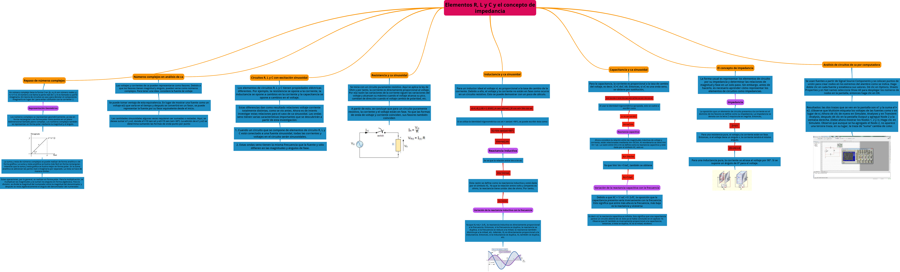

### 3. EXPLICACIÓN Y RESOLUCIÓN DE EJERCICIOS O PROBLEMAS

#### Capitulo 15 (Fundamentos de ca)

***1.	¿A qué se refiere “voltaje de ca” y “corriente de ca”?***

El voltaje de ca es aquel cuya polaridad varía periódicamente entre positiva y negativa. La corriente de ca es aquella cuya dirección varía periódicamente.

***3.	a. ¿Qué significa valor instantáneo? b. Para la figura 15-74, determine los voltajes instantáneos en t =0, 1, 2, 3, 4, 5, 6, 7 y 8 ms***

a.	La magnitud de una forma de onda (tal como voltaje o corriente) en cualquier instante.

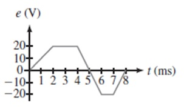

b.	0, 10, 20, 20, 20, 0, -20, -20, 0 (todos en V)

***5.	La fuente de la figura 15-76 tiene la forma de onda de la figura 15-74. Determine la corriente en t = 0, 1, 2, 3, 4, 5, 6, 7, y 8 ms. Incluya el signo.***

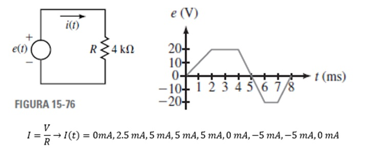

***7.	Para cada uno de los siguientes, determine la frecuencia: a.T=0.5s b.T=100s c.5T=80us***

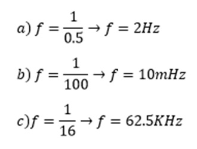

***9. Determine el periodo y la frecuencia de la forma de onda de la figura 15-77***

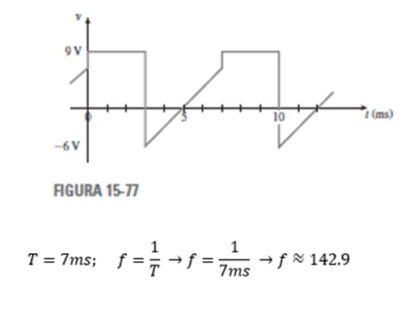

***11. ¿Cuál es el voltaje pico a pico para la figura 15-77? ¿Cuál es la corriente pico a pico de la figura 15-78?***

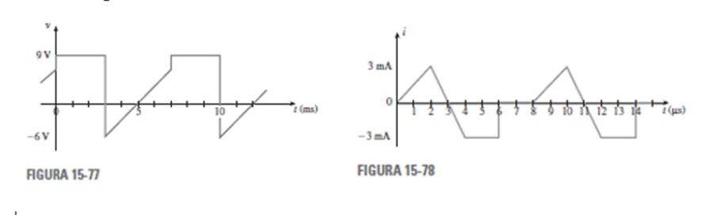

El voltaje pico a pico es 15 V y la corriente pico a pico es 6 mA.

***13.	¿A través de cuántos ciclos pasa en 2 minutos y 57 segundos una onda cuadrada con una frecuencia de 847 Hz?***

N=t*f

N= 177*847

N=149919 ciclos

***15.	Dos formas de onda tienen periodos de T1 y T2 respectivamente. Si T1 = 0.25T2 y f1 = 10 kHz, ¿cuáles son los valores de T1, T2 y f2?***

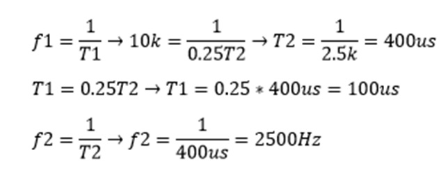

***17.	Dado el voltaje v = Vm sen (a). Si Vm = 240 V, ¿qué valor tiene v cuando a =37°?***

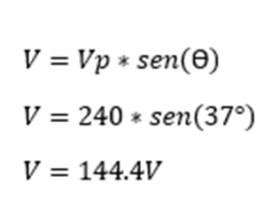

***19.	Un voltaje sinusoidal tiene un valor de 50 V cuando a =150. ¿Qué valor tiene Vm?***

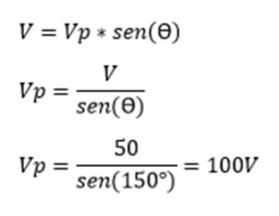

***21.	Convierta los siguientes ángulos de grados a radianes: a. 10° b. 25° c. 80°  d. 150° e. 350° f. 620°***

***23. Si el periodo de la forma de onda en la figura 15-80 es 180 ms, calcule la corriente en t=30, 75, 140 y 315 ms***

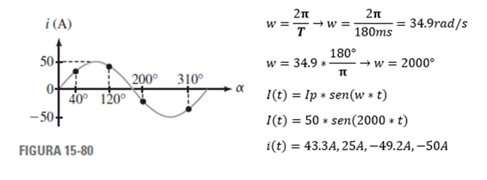

***25. Una onda seno de 20 kHz tiene un valor de 50 volts cuando t=5 us. Determine Vm y dibuje la forma de onda***

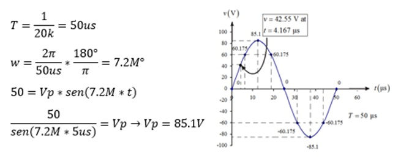

***27. Calcule q en radianes por segundo para cada uno de los siguientes casos:a. T =100 ns  b. f =30 Hz  c. 100 ciclos en 4 s   d. periodo = 20 ms   e. 5 periodos en 20 ms***
         
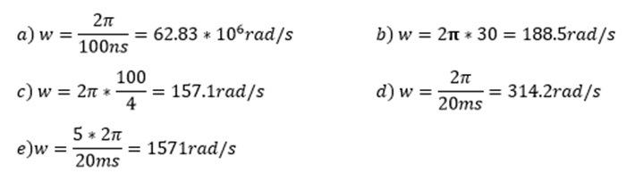

***29. Determine las ecuaciones para las ondas seno con lo siguiente:a. Vm = 170 V, f = 60 Hz  b. Im = 40 uA, T =10 ms  c. T =120 us, v = 10 V en t =12 us***
 
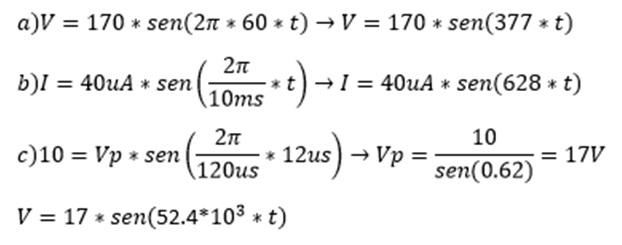

***31. Una onda seno tiene un voltaje pico a pico de 40 V y T = 50 ms. Determine su ecuación.***

***33. Dada i=47 sen 8260t mA, determine la corriente cuando t = 0 s, 80, 410 y 1200 us.***

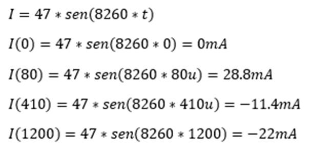

#### Capitulo 16 (Elementos R, L y C y el concepto de impedancia)

***1. Convierta cada uno de los siguientes números a forma polar:***

***a. 5 +j12***

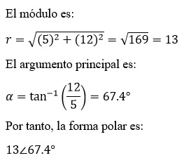

***b. 9-j6***

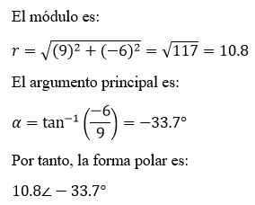

***c. -8+j15***

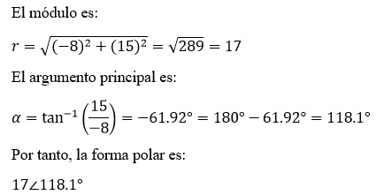

***d. -10-j4***

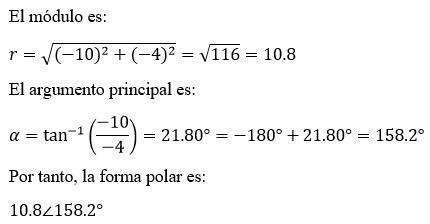

***3. Grafique cada uno de los siguientes valores en el plano complejo:***

***a. 4+j6***

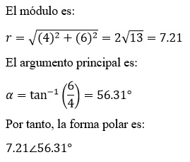

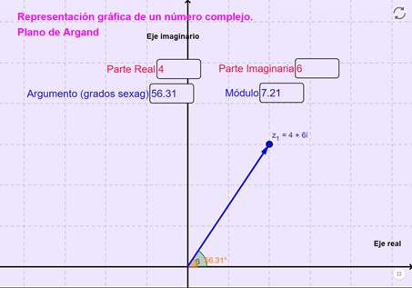

***b. j4***

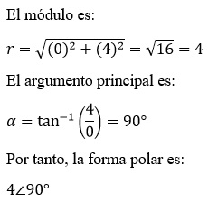

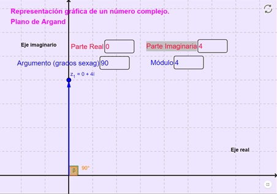

***c. 6∠-90°***

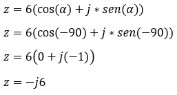

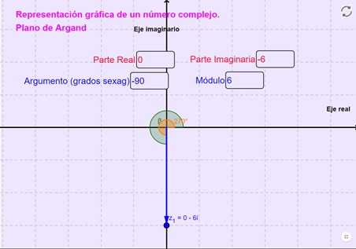

***d. 10∠135°***

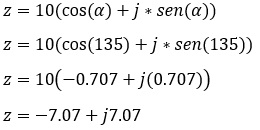

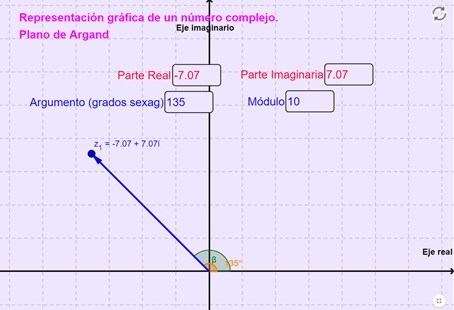

***5. Exprese sus respuestas en forma rectangular.***

***a. (4 +j8)+ (3-j2)***

***b. (4+j8)-(3-j2)***

***c. (4.1-j7.6)+12∠20°***

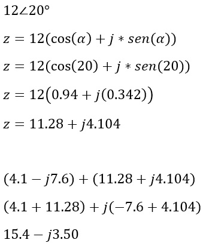

***d. 2.9∠25° -7.3 ∠-5°***

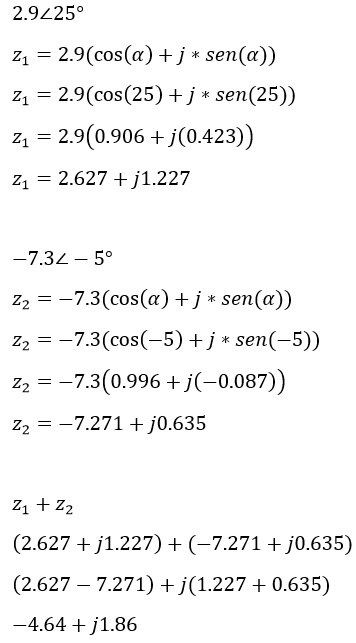

***e. 9.2∠-120° -(2.6+j4.1)***

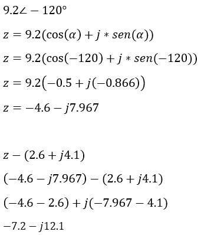

***f. 1/3+j4+1/8-j6***

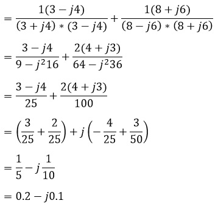

***7.  Reduzca cada corriente siguiente a forma polar:***

***a. 15-j6-((18∠40°+(12+j8))/11+j11)***

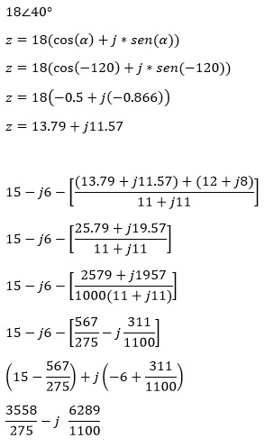

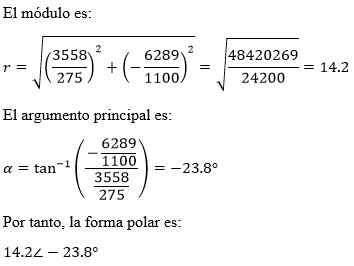

***b. (21∠20°-j41)/(36∠0°+(1+j12)-11∠40°)***

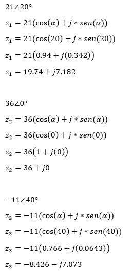

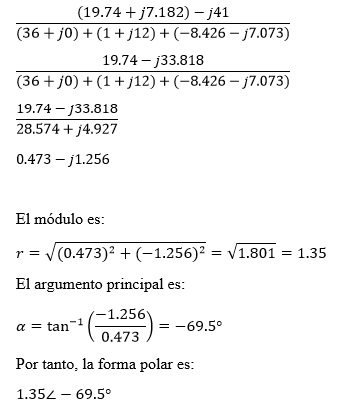

***c. ((18∠40°-18∠-40°)/7+j12) - ((16+j17+21∠-60°)/4)***

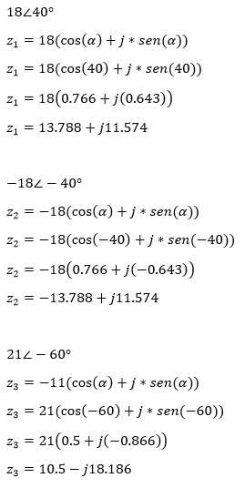

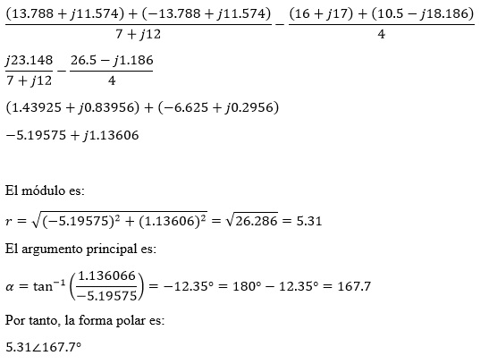

***9. Determine el equivalente sinusoidal para cada una de las fuentes transformadas de la figura 16-48.***

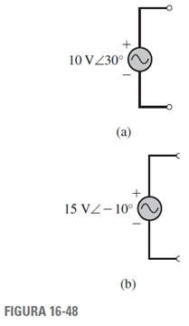

***a.***

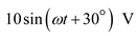

***b.***

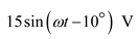

***11. Repita el problema 10 para v = e_1- e_2.***

***a.***

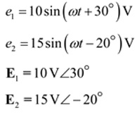

***b.***

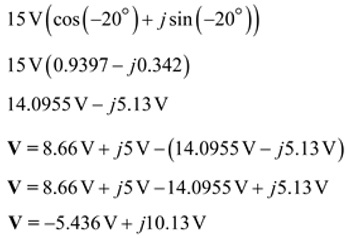

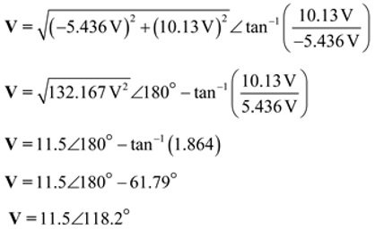

***c.***

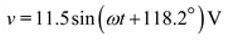

***13. Para la figura 16-50, i_1 = 25 sen (wt +36°) mA e i_2= 40 cos (wt -10°) mA.***

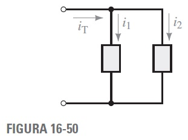

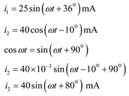

***a. Determine los fasores I1, I2 e IT.***

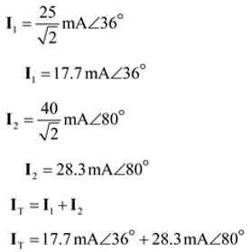

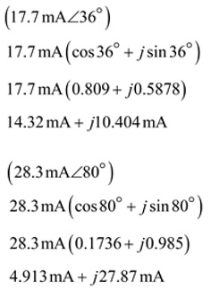

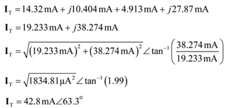

***b. Determine la ecuación para iT en el dominio del tiempo.***

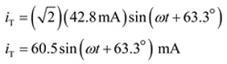

***15. Para la figura 16-18, i1 =7 sen wt mA, i2 =4 sen (wt -90°) mA e i3=6 sen (wt +90°) mA.***

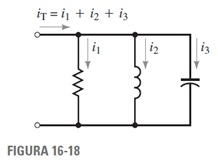

***a. Determine los fasores I1, I2, I3 e IT***

***b. Determine la ecuación para iT en el dominio del tiempo.***

***17. Para la figura 16-52, R=12 Ω. Para cada uno de los siguientes casos determine la corriente o voltaje y grafíquelo.***

***a. v=120 sen wt V, i=.......***

***b. v=120 sen(wt+27°)V, i=........***

***c. i=17 sen(wt-56°)mA, v=......***

***d. i= -17 cos(wt-67°) uA, v= .....***

***19. Dos resistores R1 = 10 kΩ y R2 = 12.5 kΩ están en serie. Si i  14.7 sen (wt+39°) mA,***

***a. ¿Cuánto valen vR1 y vR2?***

***b.  Calcule vT = vR1+ vR2 y compárelo con vT calculada a partir de vT =i RT.***

***21. Para la figura 16-53, Vm = 10 V e Im = 5 A. Para cada expresión, determine la cantidad solicitada.***

***a. vL = 10 sen (wt + 60°) V, iL = .....***

***b. vL = 10 sen (wt - 15°) V, iL = ......***

***c. iL = 5 cos (wt - 60°) A, vL = ......***

***d. iL = 5 sen (wt + 10°) A, vL = ......***

***23. Para la figura 16-53, e = 100 sen wt y L = 0.5 H. Determine iL a .....***

***a. 60 Hz***

***b. 1000 Hz***

***c. 500rad/s***

***25. Para la figura 16-53, si***

***a. vL = 40 sen (wt + 30°) V, iL = 364 sen (wt - 60°) mA y L = 2 mH, ¿cuál es el valor de f?***

***b. iL = 250 sen (wt + 40°) A, vL = 40 sen (wt + θ ) V, y f  500 kHz, ¿cuál es el valor de L y θ?***

***27. ¿Cuál es la reactancia de un capacitor de 5 uF a .....***

***a. 60Hz***

***b. 1000Hz***

***c. 500 rad/s***

***29.Para la figura 16-54, C = 50 uF.***

***a. vC = 100 sen377t V, ¿cuánto vale iC?***

***b. iC = 10 sen(2π * 400t - 60°), ¿cuánto vale vC?***

***31. Determine la impedancia de cada elemento de circuito de la figura 16-55.***

***a.***

***b.***

***c.***

***33. Si la corriente a través de cada elemento de circuito de la figura 16-56 es 0.5 A∠0°:***

***a. Determine cada voltaje en forma fasorial.***

A.

B.

C.

***b. Exprese cada voltaje en forma del dominio del tiempo.***

A.

B.

C.

***35. Para cada circuito de la figura 16-57 determine la incógnita.***

***a.***

***b.***

### 4. VIDEO

### 5. CONCLUSIONES 

- Se puede concluir que mediante distintos tipos de ejercicios propuestos sea por  los fundamentos de ca o por  los elementos de R, L y C y el concepto de impedancia, que lo aprendido en clases se ha clarificado.

### 6. BIBLIOGRAFÍA

Robbins, A., & Miller, W. (2008). Análisis de circuitos. Estados Unidos: Cengage Learning.
