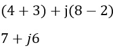
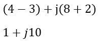
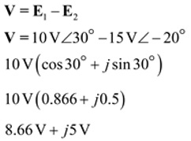
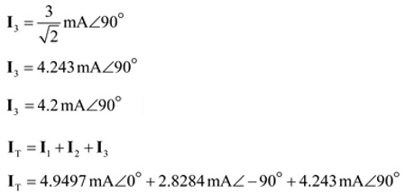
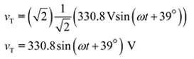
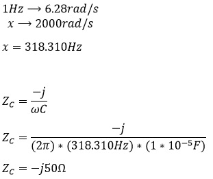

# Informe Tarea N°8

**Integrantes:**

Christian Bonifaz, Mateo Calderon, Josue Camacho, Luis Guevara

**NRC:** 5415

**Docente:** Ing. Darwin Alulema

**Tema:** Capitulo 15 (Fundamentos de ca) y capitulo 16 (Elementos R, L y C y el concepto de impedancia) de Análisis de Circuitos - Robbins, Miller

### 1. OBJETIVOS

- Clarificar el estudio de los fundamentos de ca además de los elementos de R, L y C, el concepto de impedancia, todo esto aplicando los conocimientos aprendidos durante clases.

### 2. MARCO TEÓRICO

#### Capitulo 15 (Fundamentos de ca)

#### Capitulo 16 (Elementos R, L y C y el concepto de impedancia)

### 3. EXPLICACIÓN Y RESOLUCIÓN DE EJERCICIOS O PROBLEMAS

#### Capitulo 15 (Fundamentos de ca)

#### Capitulo 16 (Elementos R, L y C y el concepto de impedancia)

***1. Convierta cada uno de los siguientes números a forma polar:***

***a. 5 +j12***

***b. 9-j6***

***c. -8+j15***

***d. -10-j4***

***3. Grafique cada uno de los siguientes valores en el plano complejo:***

***a. 4+j6***

***b. j4***

***c. 6∠-90°***

***d. 10∠135°***

***5. Exprese sus respuestas en forma rectangular.***

***a. (4 +j8)+ (3-j2)***

***b. (4+j8)-(3-j2)***

***c. (4.1-j7.6)+12∠20°***

***d. 2.9∠25° -7.3 ∠-5°***

***e. 9.2∠-120° -(2.6+j4.1)***

***f. 1/3+j4+1/8-j6***

***7.  Reduzca cada corriente siguiente a forma polar:***

***a. 15-j6-((18∠40°+(12+j8))/11+j11)***

***b. (21∠20°-j41)/(36∠0°+(1+j12)-11∠40°)***

***c. ((18∠40°-18∠-40°)/7+j12) - ((16+j17+21∠-60°)/4)***

***9. Determine el equivalente sinusoidal para cada una de las fuentes transformadas de la figura 16-48.***

***a.***

***b.***

***11. Repita el problema 10 para v = e_1- e_2.***

***a.***

***b.***

***c.***

***13. Para la figura 16-50, i_1 = 25 sen (wt +36°) mA e i_2= 40 cos (wt -10°) mA.***

***a. Determine los fasores I1, I2 e IT.***

***b. Determine la ecuación para iT en el dominio del tiempo.***

***15. Para la figura 16-18, i1 =7 sen wt mA, i2 =4 sen (wt -90°) mA e i3=6 sen (wt +90°) mA.***

***a. Determine los fasores I1, I2, I3 e IT***

***b. Determine la ecuación para iT en el dominio del tiempo.***

***17. Para la figura 16-52, R=12 Ω. Para cada uno de los siguientes casos determine la corriente o voltaje y grafíquelo.***

***a. v=120 sen wt V, i=.......***

***b. v=120 sen(wt+27°)V, i=........***

***c. i=17 sen(wt-56°)mA, v=......***

***d. i= -17 cos(wt-67°) uA, v= .....***

***19. Dos resistores R1 = 10 kΩ y R2 = 12.5 kΩ están en serie. Si i  14.7 sen (wt+39°) mA,***

***a. ¿Cuánto valen vR1 y vR2?***

***b.  Calcule vT = vR1+ vR2 y compárelo con vT calculada a partir de vT =i RT.***

***21. Para la figura 16-53, Vm = 10 V e Im = 5 A. Para cada expresión, determine la cantidad solicitada.***

***a. vL = 10 sen (wt + 60°) V, iL = .....***

***b. vL = 10 sen (wt - 15°) V, iL = ......***

***c. iL = 5 cos (wt - 60°) A, vL = ......***

***d. iL = 5 sen (wt + 10°) A, vL = ......***

***23. Para la figura 16-53, e = 100 sen wt y L = 0.5 H. Determine iL a .....***

***a. 60 Hz***

***b. 1000 Hz***

***c. 500rad/s***

***25. Para la figura 16-53, si***

***a. vL = 40 sen (wt + 30°) V, iL = 364 sen (wt - 60°) mA y L = 2 mH, ¿cuál es el valor de f?***

***b. iL = 250 sen (wt + 40°) A, vL = 40 sen (wt + θ ) V, y f  500 kHz, ¿cuál es el valor de L y θ?***

***27. ¿Cuál es la reactancia de un capacitor de 5 uF a .....***

***a. 60Hz***

***b. 1000Hz***

***c. 500 rad/s***

***29.Para la figura 16-54, C = 50 uF.***

***a. vC = 100 sen377t V, ¿cuánto vale iC?***

***b. iC = 10 sen(2π * 400t - 60°), ¿cuánto vale vC?***

***31. Determine la impedancia de cada elemento de circuito de la figura 16-55.***

***a.***

***b.***

***c.***

***33. Si la corriente a través de cada elemento de circuito de la figura 16-56 es 0.5 A∠0°:***

***a. Determine cada voltaje en forma fasorial.***

A.

B.

C.

***b. Exprese cada voltaje en forma del dominio del tiempo.***

A.

B.

C.

***35. Para cada circuito de la figura 16-57 determine la incógnita.***

***a.***

***b.***

### 4. VIDEO

### 5. CONCLUSIONES 

- Se puede concluir que mediante distintos tipos de ejercicios propuestos sea por  los fundamentos de ca o por  los elementos de R, L y C y el concepto de impedancia, que lo aprendido en clases se ha clarificado.

### 6. BIBLIOGRAFÍA

Robbins, A., & Miller, W. (2008). Análisis de circuitos. Estados Unidos: Cengage Learning.
